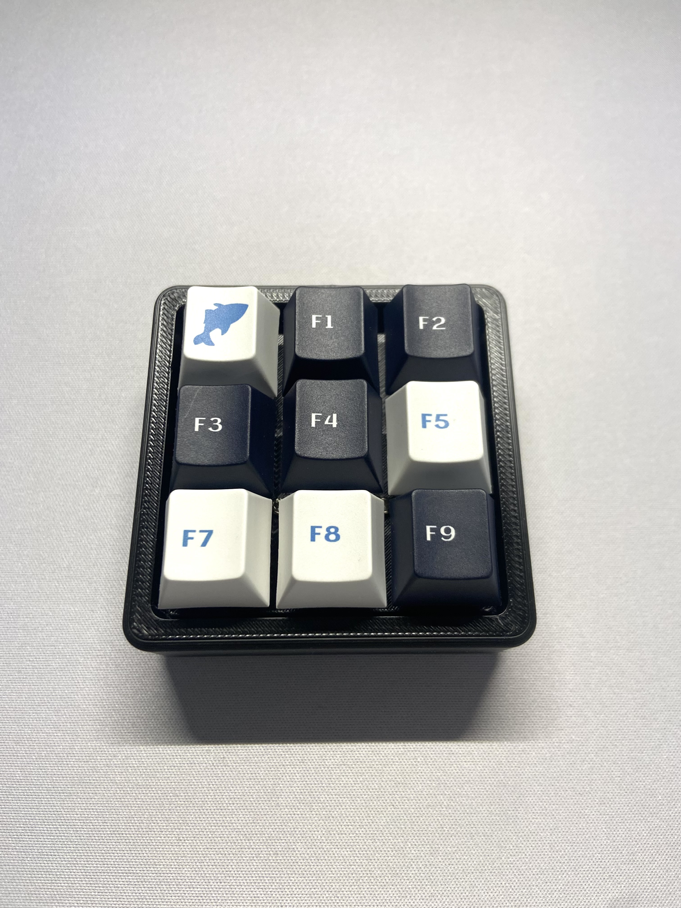

# Macropad V1 - Build Guide  
*A handwired 3×3 macropad powered by CircuitPython & KMK* 
<table>
  <tr>
    <td></td>
  </tr>
</table> 

---

## 📦 Parts List  

| Component         | Details                           | Cost  |
|-------------------|-----------------------------------|-------|
| **MCU**           | Adafruit KB2040                   | $15   |
| **Diodes**        | 9× 1N4148                         | $1    |
| **Switches**      | 9× MMD Princess Switch V4 Linear  | $4    |
| **Keycaps**       | Custom 3D Printed                 | –     |
| **Wire**          | Wire + Copper wire                | –     |
| **Standoffs**     | 4× M2 (from 300pc pack)           | $30   |

---

## 🎨 Design Overview

**Layout**  
`3×3 Matrix`  
**Wiring**  
`Handwired`  
**Case**  
`Full Enclosure`

**Firmware**  
`CircuitPython + KMK`  
**Keycaps**  
`Custom Keycaps`  
**MCU Pins**  
`GPIO 2-7`

---

## 🔧 Step 1: Assembly  

### **Plate & Wiring**  
- Print the switch plate using:  
  - [Keyboard Layout Editor](https://www.keyboard-layout-editor.com/)  
  - [Plate Builder](http://builder.swillkb.com/)  
- Use a **matrix wiring system** to minimize wire connections.  

### **Schematic & Soldering**  
<table>
  <tr>
    <td></td>
  </tr>
  <tr>
    <td align="center"><em>Macropad Schematic</em></td>
  </tr>
</table>

- Solder diodes to switches, then connect rows/columns to the MCU (GPIO 2-7):  
<table>
  <tr>
    <td></td>
    <td></td>
  </tr>
  <tr>
    <td align="center"><em>Switch Matrix</em></td>
    <td align="center"><em>MCU Connections</em></td>
  </tr>
</table>

---

## 💻 Step 2: Firmware Setup  

### **Flashing & Testing**  
1. Flash the **KB2040** with [CircuitPython](https://circuitpython.org/).  
2. Install [KMK Firmware](https://github.com/KMKfw/kmk_firmware/tree/main).  
3. Map GPIO pins in KMK and test basic key outputs (e.g., numbers 1-9).  

<table>
  <tr>
    <td></td>
  </tr>
  <tr>
    <td align="center"><em>KMK Pin Configuration</em></td>
  </tr>
</table>

### **Pinout Reference**  
<table>
  <tr>
    <td></td>
  </tr>
  <tr>
    <td align="center"><em>Adafruit KB2040 Pinout</em></td>
  </tr>
</table>

---

## ⌨️ Step 3: Macros & Final Assembly  

### **Programming Macros**  
- Use [KMK Keycodes](https://github.com/KMKfw/kmk_firmware/blob/main/docs/en/keycodes.md) to assign macros.  
- Example:  
  <table>
    <tr>
      <td></td>
    </tr>
    <tr>
      <td align="center"><em>KMK Macro Example</em></td>
    </tr>
  </table>

### **Final Assembly**  
- Secure switches into the case using **M2 standoffs**.  
- Screw the plate into the enclosure.  

<table>
  <tr>
    <td></td>
  </tr>
  <tr>
    <td align="center"><em>Completed Macropad</em></td>
  </tr>
</table>

---

### 🌟 Done!  
Your custom macropad is ready to use. 
